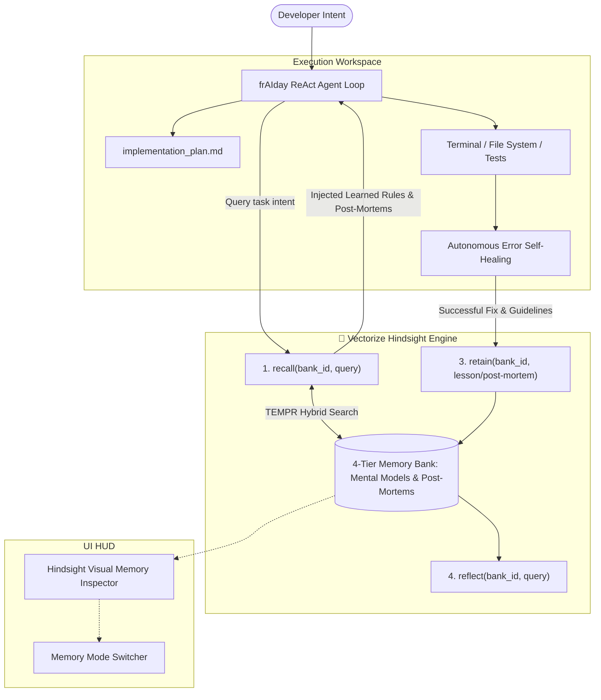

# Building frAIday: How We Used Vectorize Hindsight to Give AI Coding Agents Persistent Memory That Actually Learns

**Subtitle:** *Why traditional RAG fails for autonomous software engineering, and how Hindsight's 4-tier memory hierarchy eliminates repeated mistakes across sessions.*

**Author:** Varshith Yaragani  
**Repository:** [https://github.com/Varshith4611C/frAIday](https://github.com/Varshith4611C/frAIday)  
**Hackathon:** Vectorize Hindsight Hackathon 2026  

---

## Introduction: The Amnesia Epidemic in AI Agents

If you have ever worked with an AI coding assistant on a real-world software project, you know the daily frustration:
- You tell the model that your local PostgreSQL container is mapped to port **5433**, not 5432.
- You tell it that your project migrated to **Pydantic v2** and strictly forbids `class Config:`.
- You tell it that your frontend runs **ES Modules** and crashes on `require()`.

The AI patches the immediate code. But tomorrow morning in a fresh session, **it is back to square one**. It makes the exact same assumptions, crashes on the same default ports, and repeats the same mistakes.

Current LLM developer tooling treats memory as an afterthought. Most solutions rely on naive conversation history windows or flat vector similarity search (RAG). But software engineering is not just about finding semantically similar text chunks—**it is about learning from past operational outcomes**.

That is why we built **frAIday**—an autonomous AI software engineering and SRE incident agent powered natively by **Vectorize Hindsight**.

---

## Why Traditional RAG Fails for Agentic Coding

Standard RAG systems suffer from two fatal flaws when applied to autonomous coding agents:

1. **Epistemic Confusion**: If an error log and its fix are stored as flat text chunks, a cosine similarity search retrieves both without understanding which one is the current truth versus the obsolete error.
2. **Temporal Blindness**: Standard embeddings cannot differentiate between a rule established 5 minutes ago and a deprecated pattern from 6 months ago.

Developers do not want an AI that regurgitates massive text dumps into its prompt window. They need an agent that has internal **mental models**, remembers **incident post-mortems**, and **never repeats a mistake**.

---

## Enter Vectorize Hindsight: #1 on LongMemEval

Vectorize Hindsight is an open-source biomimetic memory system designed specifically for AI agents, achieving **#1 state-of-the-art accuracy on the LongMemEval benchmark**.

Instead of storing raw text strings, Hindsight operates through three foundational primitives:
- **`retain(bank_id, content)`**: Deconstructs raw conversations, error logs, and user reviews into structured entities, relations, and empirical facts.
- **`recall(bank_id, query)`**: Employs **TEMPR** (Temporal, Entity, Matching, Proximity, Ranking) retrieval—executing vector search, BM25 keyword matching, entity graph traversal, and temporal recency in parallel, then fusing them with confidence scores.
- **`reflect(bank_id, query)`**: Synthesizes accumulated memories into a coherent, reasoned rule rather than dumping raw snippets.

---

## The 4-Tier Cognitive Hierarchy in frAIday

To integrate Hindsight into frAIday's autonomous software engineering loop, we organized the repository memory bank into four strict tiers:

```
┌──────────────────────────────────────────────────────────────┐
│ 1. MENTAL MODELS (Highest Priority)                          │
│    Governing directives, team standards, architectural rules │
├──────────────────────────────────────────────────────────────┤
│ 2. OBSERVATIONS                                              │
│    Deduplicated empirical facts backed by proof counts       │
├──────────────────────────────────────────────────────────────┤
│ 3. WORLD FACTS                                               │
│    Objective environment & repository configurations         │
├──────────────────────────────────────────────────────────────┤
│ 4. EXPERIENCE FACTS                                          │
│    Past terminal post-mortems, error logs & verified patches │
└──────────────────────────────────────────────────────────────┘
```

1. **Mental Models**: High-level governing procedures (e.g., *"When configuring PostgreSQL, ALWAYS use host 'localhost' on port 5433 with sslmode=disable"*).
2. **Observations**: Deduplicated empirical facts backed by proof counts (e.g., *"Docker Compose maps Postgres to 5433; verified across 4 runs"*).
3. **World Facts**: Objective configurations (e.g., *"Repository uses Python 3.11+ and Vanilla JS ES Modules"*).
4. **Experience Facts**: Incident post-mortems and terminal bug resolutions (e.g., *"`ConnectionRefusedError`: Agent assumed port 5432; resolution: updated to 5433"*).

---

## Architecture: How frAIday Operates



frAIday is built on a full **Antigravity Autonomous IDE**:
- **Real Subprocess Terminal**: Runs shell commands (`pip`, `npm`, tests, scripts) in the active workspace.
- **Isolated Multi-Workspaces**: Switch, create, and delete isolated project directories directly from the UI with zero session cross-talk.
- **Monaco Code Editor & Live Preview**: Real-time syntax highlighting, multi-tab editing, and live browser iframe preview with DevTools console error forwarding.
- **Autonomous Self-Healing**: Terminal errors and tracebacks are automatically piped back into the ReAct loop. The agent inspects errors, patches code, verifies the fix, and calls `retain()` to permanently remember the solution.

---

## The Breakthrough: Stateless Baseline vs. Hindsight Active

In our live hackathon benchmark demonstration, we built a 1-click **"Stateless Baseline vs. Hindsight Active"** comparison toggle:

### The Test Mission
> *"Configure database connection settings for local PostgreSQL service and test connection."*

### 1. Without Hindsight (Stateless Baseline Mode)
The agent operates like conventional AI tools with memory switched off. It blindly defaults to standard PostgreSQL convention: `localhost:5432` with `sslmode=require`.
- The agent writes the database configuration.
- The terminal executes `python test_db.py`.
- **Result**: `ConnectionRefusedError: [Errno 111] Connection refused`.
- The agent has repeated a mistake that was already resolved in a prior sprint.

### 2. With Hindsight (Learning Mode Active)
Before generating `implementation_plan.md`, frAIday executes a TEMPR hybrid recall against the task intent.
- In **18ms**, Hindsight injects:
  ```json
  {
    "type": "mental_model",
    "topic": "Postgres Port Convention",
    "content": "PostgreSQL service runs on port 5433 with sslmode=disable. Port 5432 is reserved for host services."
  }
  ```
- The agent factors this rule directly into its implementation plan.
- It configures port `5433` and `sslmode=disable`.
- The terminal executes `python test_db.py`.
- **Result**: **Exit Code 0 on the very first try!** Zero trial-and-error, zero wasted tokens.

---

## Benchmark Results

| Scenario | Objective | Without Hindsight (Stateless Baseline) | With Hindsight (Learning Mode Active) |
| :--- | :--- | :--- | :--- |
| **1. Database Port Trap (INC-104)** | Configure PostgreSQL service connection & test. | Defaults to `localhost:5432`. Crashes with `ConnectionRefusedError`! | Recalls Mental Model #1 + INC-104 post-mortem in 18ms. Automatically uses port `5433`. Tests pass on 1st attempt! |
| **2. Pydantic v2 Migration** | Write user authentication schema & validator. | Emits deprecated Pydantic v1 `class Config: orm_mode = True`, triggering warnings/errors. | Recalls Mental Model #2: writes modern `model_config = ConfigDict(from_attributes=True)` and `.model_dump()`. |
| **3. DevOps CORS Protocol** | Build lightweight HTTP server in workspace. | Omits CORS headers and OPTIONS handler, causing browser iframe preview to block requests. | Recalls Mental Model #3: automatically adds `Access-Control-Allow-Origin: *` and `/health` probe. |

---

## Conclusion: AI Agents That Compound Value

The biggest leap in AI agent development will not come from slightly larger context windows—it will come from **agents that compound value over time**.

By integrating **Vectorize Hindsight** into **frAIday**, we transformed a standard autonomous coding assistant into a persistent, reliable team asset that remembers every outage, learns every repository convention, and never makes the same mistake twice.

---

## Links & Resources

- 🌟 **GitHub Repository**: [https://github.com/Varshith4611C/frAIday](https://github.com/Varshith4611C/frAIday)
- 🧠 **Vectorize Hindsight**: [https://hindsight.vectorize.io](https://hindsight.vectorize.io)
- 📦 **Submission Kit**: [https://github.com/Varshith4611C/frAIday/blob/main/HACKATHON_SUBMISSION_KIT.md](https://github.com/Varshith4611C/frAIday/blob/main/HACKATHON_SUBMISSION_KIT.md)
