# 🧠 Vectorize Hindsight Native Integration Architecture

frAIday is an autonomous software engineering and SRE incident response agent built with **Vectorize Hindsight**—the biomimetic memory system achieving #1 state-of-the-art accuracy on the LongMemEval benchmark.

---

## 1. Why Traditional RAG Fails for Autonomous Agents

Traditional RAG and vector databases (Pinecone, Chroma, pgvector) only perform naive cosine similarity over raw text chunks. This breaks in autonomous coding and DevOps workflows:
1. **Epistemic Confusion**: Agents cannot differentiate between past hypotheses, outdated configurations, and verified facts.
2. **Temporal Blindness**: When port 5432 was used last year but port 5433 was adopted in last week's migration, vector search treats both as equally probable.
3. **No Cognitive Synthesis**: Returning raw text fragments forces the agent to re-derive rules from scratch instead of applying learned mental models.

**Vectorize Hindsight** resolves these failures through three core primitives: **Retain**, **Recall**, and **Reflect**.

---

## 2. The 4-Tier Memory Hierarchy

Hindsight organizes knowledge into four prioritized layers:

```
┌──────────────────────────────────────────────────────────────┐
│ 1. MENTAL MODELS (Highest Priority)                          │
│    Governing directives, team standards, architectural rules │
├──────────────────────────────────────────────────────────────┤
│ 2. OBSERVATIONS                                              │
│    Deduplicated empirical facts backed by proof counts       │
├──────────────────────────────────────────────────────────────┤
│ 3. WORLD FACTS                                               │
│    Objective environment & repository configurations         │
├──────────────────────────────────────────────────────────────┤
│ 4. EXPERIENCE FACTS                                          │
│    Past terminal post-mortems, error logs & verified patches │
└──────────────────────────────────────────────────────────────┘
```

---

## 3. Autonomous Execution & Learning Lifecycle

```mermaid
sequenceDiagram
    autonumber
    actor Dev as Developer / User
    participant HUD as frAIday Frontend HUD
    participant Agent as ReAct Execution Engine
    participant Hindsight as Vectorize Hindsight Layer
    participant Host as Terminal / File System / Docker

    Dev->>HUD: Enters Objective: "Configure DB connection & test"
    HUD->>Agent: executeGoal(prompt)
    
    rect rgb(22, 32, 50)
    Note over Agent,Hindsight: Phase 1: Pre-Execution Hybrid Recall (TEMPR)
    Agent->>Hindsight: POST /api/hindsight/recall (query="postgres connection")
    Hindsight-->>Agent: Returns 4-Tier Ranked Context: [Mental Model #1: Port 5433, sslmode=disable]
    end

    Agent->>Agent: Formulates implementation_plan.md respecting recalled rules
    Agent->>Dev: Pauses at Antigravity Planning Gate for Review
    Dev->>Agent: Clicks "Approve & Proceed"

    rect rgb(22, 32, 50)
    Note over Agent,Host: Phase 2: Autonomous Tool Execution
    Agent->>Host: write_to_file("db_config.py", port=5433)
    Agent->>Host: run_command("python test_db.py")
    Host-->>Agent: Exit Code 0 (Connection Succeeded)
    end

    rect rgb(22, 32, 50)
    Note over Agent,Hindsight: Phase 3: Autonomous Memory Retention
    Agent->>Hindsight: POST /api/hindsight/retain (type="experience_fact", status="verified")
    Hindsight-->>HUD: Telemetry Stream: Retained new verified resolution
    end

    Agent-->>Dev: Mission Completed & Documented in walkthrough.md
```



---

## 4. TEMPR Multi-Strategy Hybrid Retrieval

When `recall(bank_id, query)` is invoked, Hindsight executes parallel retrieval across four dimensions:
- **T - Temporal Awareness**: Recency decay boosts recent migrations and penalizes superseded post-mortems.
- **E - Entity & Graph Traversal**: Relates technologies (`Postgres` -> `Docker Compose` -> `Port 5433`).
- **M - Matching (BM25 + Sparse Keywords)**: Guarantees exact matches on error signatures and error codes (`ConnectionRefusedError: [Errno 111]`).
- **P - Proximity & Dense Vector Search**: Captures semantic intent across natural language descriptions.
- **R - Ranking & Proof Fusing**: Evidence count boosts memories that have been validated across multiple executions.

---

## 5. Dual-Mode Deployment Architecture

frAIday supports zero-friction deployment:
1. **Hindsight Cloud Managed Service**:
   - Base URL: `https://api.hindsight.vectorize.io`
   - Configured via `HINDSIGHT_API_KEY` (use promo code `MEMHACK99` for $50 free credits).
2. **Local Self-Hosted Docker**:
   - `docker run -p 8888:8888 -p 9999:9999 ghcr.io/vectorize-io/hindsight:latest`
3. **Embedded High-Fidelity TEMPR Fallback**:
   - Implemented in `hindsight_service.py` with persistent storage in `.fraiday_hindsight_bank.json`.
   - Guarantees 100% offline uptime, zero-failure live demos, and immediate out-of-the-box evaluation without requiring initial API keys.

---

## 6. Endpoints Specification

| Endpoint | Method | Description |
| :--- | :---: | :--- |
| `/api/hindsight/status` | `GET` | Returns connection status, active bank, engine type, and tier metrics. |
| `/api/hindsight/bank` | `GET` | Returns complete memory bank cards grouped by tier. |
| `/api/hindsight/recall` | `POST` | Executes TEMPR hybrid search for a query and generates system prompt context. |
| `/api/hindsight/retain` | `POST` | Ingests new mental models, observations, world facts, or incident post-mortems. |
| `/api/hindsight/reflect` | `POST` | Triggers cognitive synthesis reasoning over accumulated memories. |
| `/api/hindsight/reset-scenarios` | `POST` | Re-seeds memory bank to benchmark hackathon scenarios for clean live demonstrations. |
| `/api/hindsight/config` | `POST` | Updates runtime Hindsight credentials (`api_key`, `base_url`, `bank_id`). |
