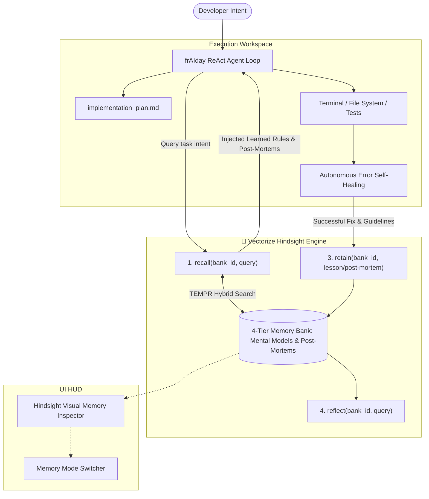

# ⚡ frAIday — Autonomous Software Engineer Powered by Vectorize Hindsight

<div align="center">


[](https://hindsight.vectorize.io)
[](https://python.org)
[](https://opensource.org/licenses/MIT)

<br/>

**The Autonomous Software Engineering & SRE Incident Agent with Persistent Biomimetic Memory That Actually Learns Over Time.**

[Quickstart](#-quickstart) • [Why Hindsight?](#-why-vectorize-hindsight) • [Architecture](#-architecture) • [Submission Kit](HACKATHON_SUBMISSION_KIT.md)

</div>

---

## 💡 The Core Problem: AI Agent Amnesia

Every developer working with AI coding assistants knows the daily frustration:
- You spend 20 minutes explaining that your Docker Postgres container is mapped to **port 5433**, not 5432.
- You tell the model your codebase migrated to **Pydantic v2** and forbids `class Config:`.
- The AI fixes the bug. But tomorrow morning in a fresh session, **it makes the exact same mistake again.**

Stateless AI agents are yesterday's news. Standard RAG and vector databases only perform naive cosine similarity over raw text chunks—suffering from **epistemic confusion** (inability to distinguish past errors from current truths) and **temporal blindness**.

**frAIday** solves this by pairing a multi-threaded execution engine (real terminal, workspace filesystem, Monaco code editor, headless Chrome visual audit) with **Vectorize Hindsight**—the biomimetic memory system achieving **#1 state-of-the-art accuracy on the LongMemEval benchmark**.

---

## 🧠 Why Vectorize Hindsight?

Hindsight moves beyond simple conversation recall by organizing knowledge into a **4-Tier Cognitive Hierarchy**:

```
┌──────────────────────────────────────────────────────────────┐
│ 1. MENTAL MODELS (Highest Priority)                          │
│    Governing directives, team standards, architectural rules │
├──────────────────────────────────────────────────────────────┤
│ 2. OBSERVATIONS                                              │
│    Deduplicated empirical facts backed by proof counts       │
├──────────────────────────────────────────────────────────────┤
│ 3. WORLD FACTS                                               │
│    Objective environment & repository configurations         │
├──────────────────────────────────────────────────────────────┤
│ 4. EXPERIENCE FACTS                                          │
│    Past terminal post-mortems, error logs & verified patches │
└──────────────────────────────────────────────────────────────┘
```

### The 3 Foundational Primitives:
1. **`retain(bank_id, content)`**: Rather than storing raw conversation dumps, Hindsight extracts structured facts, relations, and post-mortems.
2. **`recall(bank_id, query)`**: Employs **TEMPR** (Temporal, Entity, Matching, Proximity, Ranking) retrieval—executing vector search, BM25 keyword matching, graph traversal, and temporal recency in parallel.
3. **`reflect(bank_id, query)`**: Synthesizes accumulated memories into a coherent, reasoned playbook instead of regurgitating raw snippets.

---

## 🛠️ Architecture



---

## 📁 Multiple Isolated Workspaces

frAIday features complete multi-project isolation directly from the UI:
- **Instant Workspace Switcher**: Seamlessly switch between projects (e.g. `./workspace/`, `./workspaces/calculator/`, `./workspaces/portfolio/`).
- **Dynamic File & Session Isolation**: Each workspace has its own scoped file tree, code tabs, terminal prompt (`[workspace: <name> | cwd: <path>]`), and persistent session timeline.
- **Project Lifecycle**: Create, switch, and delete workspaces directly via the Top HUD and Left Sidebar without restarting the backend.

---

## 💻 Quickstart

### 1. Clone & Install Dependencies
```bash
git clone https://github.com/Varshith4611C/frAIday.git
cd frAIday

# Install Hindsight client and Python runtime requirements
pip install -r requirements.txt # or: pip install hindsight-client
```

### 2. Configure Credentials (Optional)
frAIday includes an **embedded high-fidelity TEMPR engine** that works 100% offline out-of-the-box!
To connect to live Hindsight Cloud:
- Create an account at [ui.hindsight.vectorize.io](https://ui.hindsight.vectorize.io)
- Apply promo code **`MEMHACK99`** in the billing section for $50 free credits
- Add your credentials in [.env](file:///.env) or via the in-app **⚙️ Settings** modal:
  ```env
  HINDSIGHT_API_KEY=your_hindsight_api_key_here
  HINDSIGHT_BASE_URL=https://api.hindsight.vectorize.io
  HINDSIGHT_BANK_ID=fraiday-core-memory
  ```

### 3. Launch the Server
```bash
python server.py
```
Open your browser to: **`http://localhost:8080/index.html`**

---

## 📑 Hackathon Deliverables

- **Architecture Deep-Dive**: [HINDSIGHT_ARCHITECTURE.md](HINDSIGHT_ARCHITECTURE.md)
- **Submission Kit & Demo Scripts**: [HACKATHON_SUBMISSION_KIT.md](HACKATHON_SUBMISSION_KIT.md)
  - 60-Second Video Script
  - 3-Minute Comprehensive Walkthrough
  - Full Ready-to-Publish Article Draft
  - Ready-to-Publish Social Media Posts (LinkedIn & X)
  - Official Explanation of Hindsight Memory Usage

---

## ⚖️ License
MIT License. Developed for the Vectorize Hindsight Hackathon 2026.
